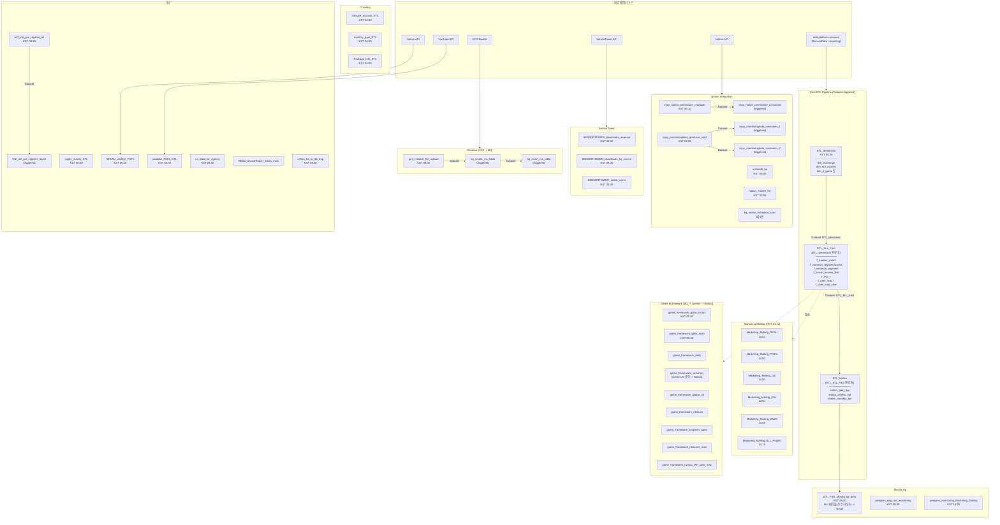

# DAG Architecture

## Dataset 트리거 체인 요약

| Producer DAG | Dataset 키 | Consumer DAG |
|---|---|---|
| `ETL_dimension` | `ETL_dimension` | `ETL_ALL_Fact` |
| `ETL_ALL_Fact` | `ETL_ALL_Fact` | `ETL_statics` |
| `gcs_creative_file_upload` | `gcs_creative_file_upload` | `bq_create_ms_table` |
| `bq_create_ms_table` | `bq_create_ms_table` | `bq_insert_ms_table` |
| `injoy_notion_permission_producer` | `injoy_notion_permission_producer` | `injoy_notion_permission_consumer` |
| `injoy_monitoringdata_producer_ver2` | `injoy_monitoringdata_producer2` | `injoy_monitoringdata_consumer_1/2` |
| `fsf2_cbt_pre_register_etl` | `fsf2_cbt_pre_register_etl` | `fsf2_cbt_pre_register_report` |
